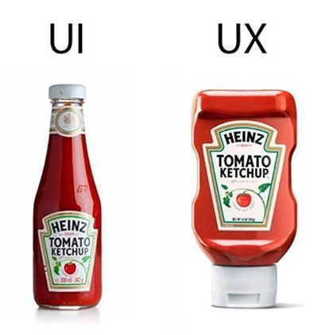

##  Module 2: UI & UX
This module focuses primarily on what the **user interface** is also touching on the differences between it and **user experience**.

##  User interface
An application is mainly built from __two main parts__: the **back-end** (which holds how the information is being changed in methods and in certain cases) and the **user interface** (that displays the information to the user). Of course, the database is a third part of an application but it is merely integrated in the back-end because it stores data.

User interface refers (as the term also suggests) the interface of an application which the user interacts with - the visual part of the project.

##  User experience
There may be discussions about the paradigm, the technology used, libraries and design patterns but we can all agree that one thing will always be mandatory to be discussed: User Experience (UX).

Often people confuse UI with UX - user experience - action that cannot be more wrong, and this is why:
- When discussing user experience, people often think that it describes what the final product looks like, how easily specific lists or pages can be reached and especially how pleasing it is to the user;
- That is what the "user interface" (UI) term means, whereas User experience involves the user interface but doesn’t consist  strictly of this, just like  a  final product doesn’t consist of only the front-end part of the application.
- User experience refers mainly to an user's engagement with a product, this, in turn, consisting of both the user interface as well as the performance of the application, how adaptable it is to _big data_ and also which _environment variables are relevant_ and which are not.

###  UX vs UI
The following parallel describes what elements create the user experience and what can be derived from the user interface, also explaining the difference between these two concepts.

[Image source](https://www.devsaran.com/sites/default/files/styles/large/public/blogimages/knowing-the-difference-between-the-ux-and-ui-design.jpg?itok=w3QwKgRm)

As you can see, all the _business analysis_, _user # researchability_ and various discovered _scenarios_ come together and define the UX, whereas the UI can be understood as the _visual design_ - how the application is supposed to look like, the colors and _layouts_ (about which we will be talk about in a further module) and everything else the _graphic designers' work_ materializes into.

####  If you are still not sure what the difference is please see the below [rough](https://medium.com/northern-dynamics/my-response-to-ketchup-bottle-ux-vs-ui-meme-56c1a14a6f98) but pretty good for a start analogy:

Which bottle would you choose?

[Image source](https://cdn-images-1.medium.com/max/800/1*Cl3Fk9iEFz9ZKhvaSVgqpA.jpeg)
